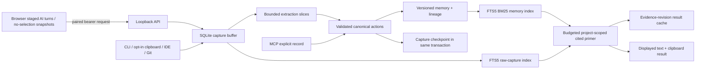

# Architecture and ownership

## Product modules

| Responsibility | Canonical implementation |
| --- | --- |
| Lifecycle/periodic extraction | owlthread/capture/engine.py |
| SQLite schema, serialized writes, migrations, readers, dedup | owlthread/db/database.py |
| Authentication, pairing, secret protection, boundary validation | owlthread/security.py; owlthread/capture/server.py |
| Durable capture producers | capture/clipboard.py, capture/connectors/, capture/git_capture.py, cli.py, extension/background.ts |
| Immutable site boundary | owlthread/site_policy.py; extension/policy.ts; manifest exclusions; capture/server.py |
| Slice scheduling, retry, checkpoints | owlthread/extraction/pipeline.py |
| Local extraction and model response schema | extraction/extractor.py; extraction/rebase.py validate_actions |
| ADD/NOOP/UPDATE/SUPERSEDE persistence | extraction/rebase.py apply_actions |
| Lexical retrieval | owlthread/primer/search.py |
| Intent, model calls, brief generation/copy | primer/classifier.py, llm.py, generator.py, engine.py |
| Tk views and background jobs | gui/app.py; primer/ui.py |
| Native clipboard, shortcut, tray | clipboard_io.py, hotkey.py, tray.py |
| MCP and permission catalog | owlthread/mcp_server.py; mcp_entry.py; owlthread/integrations/ |
| Site policy, observers, companion, popup | extension/policy.ts, content.ts, companion.ts, popup/popup.ts |

## Runtime flow

A single writer thread serializes each process's database writes. SQLite WAL, busy timeout and transactional checkpoint comparison protect concurrent processes. Model work occurs outside write transactions. A stale checkpoint or target does not partially apply a capture. Readers belong to their thread and are reclaimed when it ends. Shutdown joins producers before closing the database.

Every extraction slice is at most 4,000 characters, preferably ending at a line/sentence. Source captures remain available. Failed configured-model output remains pending; explicit local rules run only in Fallback mode. Current target context is the union of 30 lexical matches and 10 recent memories in the same project; conflicts outside that bounded window may be missed. The legacy in-memory BufferManager and alternate RebaseEngine were retired. Compatibility update_entry_statement delegates to versioned persistence.

UPDATE and SUPERSEDE insert a successor, link the predecessor, and mark it superseded in a single transaction. They differ in meaning and recorded rationale. Archiving is a user action. Duplicate normalized summaries do not insert a new memory. Existing source history is not rewritten by extraction.

The FTS5 external-content index tracks insert/update/delete through SQLite triggers and is rebuilt on first migration. bm25 weights summary 2, source 1, tags 1; positive display score is the negative FTS rank times a recency factor in [0.95, 1]. Candidate count is bounded to 200–1,000 depending on requested limit. This is real [SQLite FTS5 BM25](https://www.sqlite.org/fts5.html), not semantic vector search. Stemming uses porter/unicode61; multilingual segmentation and synonyms are limited.

Tk starts with an initial snapshot before its event loop. Subsequent reads, mutations, searches, model calls and copies use bounded workers; UI callbacks re-check view/project state. The feed caches 500 entries per project and renders the newest 100; use search to retrieve older matching entries. There is no continuous reader-thread mutation of Tk widgets.

The extension worker owns the API token, durable queue and retries. Content scripts request safe settings, never the token/raw queue. On supported AI sites a send event creates a staged prompt record immediately; completion converts it to a combined user/assistant turn under the same idempotency key. A 12-minute expiry promotes an unmatched prompt to a prompt-only capture. Existing history is baselined. The explicit Remember action needs no selection and returns the current completed turn or a sanitized visible-page snapshot. Site refusal applies before content initialization, at collection, queue drain and desktop ingestion. A queue acknowledgement means browser storage succeeded, not that a memory was extracted.

Retrieval first classifies common build/status intent locally. It performs per-quadrant and raw-capture FTS retrieval, interleaves results, removes duplicates and stops at a hard character budget before any model call. Citations distinguish canonical memory (`[#id]`) from raw source (`[C#id]`). The persistent primer cache key includes normalized query, project, intent, model, prompt hash, context hash and evidence revisions, avoiding repeated paid synthesis until relevant state changes.

## Repository scope

Python packaging discovers only owlthread*. main.py, mcp_server.py, owlthread.cmd and launch batches are entry-point shims. TypeScript is authoritative; shipped JavaScript is generated and compared before release. There is one live content observer. Duplicate stream_observer.ts copies were retired.

continue/ is a reference submodule. The missing mem0 reference gitlinks were already deleted in the starting worktree and were left that way. Their source is not imported or shipped. The original worktree/index patches and legacy files are preserved in ignored artifacts/audit-2026-09-14. No reset, commit or public upload was performed.
